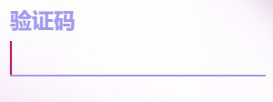
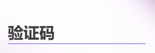

## 效果图 ##


## 代码 ##
```html
<template>
    <div class="inpbox">
        <input id="comInp" :type="inptype" required :value="props.value" :pattern="props.inppattern" /><label>
            <slot></slot>
        </label>
    </div>
</template>
```
```typescript
import {
    reactive,
    ref,
    onMounted
} from 'vue';
const props = defineProps({
    value: {
        type: String
    },
    inppattern: {
        type: String
    },
    isPassword: {
        type: Boolean
    }
})
const inptype = ref("text")
onMounted(() => {
    if (props.isPassword) {
        inptype.value = "password"
    }
})
```
```css
.inpbox{
    height: fit-content;
}
input {
    outline: none;
    border: none;
    width: 100%;
    margin-bottom: 10px;
    color: #a29bf6;
    font-size: 16px;
    border-bottom: 1px solid #a29bf6;
    background-color: transparent;
}

label {
    position: relative;
    left: 0;
    top: -33px;
    color: #3d3d3d;
    font-weight: bolder;
    pointer-events: none;
    transition: all 0.5s;
}

input:focus+label,
input:valid+label {
    top: -53px;
    color: #a29bf6;
    font-size: 12px;
}

#comInp:invalid {
    top: -53px;
    color: #ff0059;
    animation: 0.3s ease-in shake;
}

@keyframes shake {
    0% {
        margin-left: 10px;
        margin-right: 0px;
    }

    25% {
        margin-left: 0px;
        margin-right: 10px;
    }

    75% {
        margin-left: 10px;
        margin-right: 0px;
    }

    100% {
        margin-left: 0px;
        margin-right: 10px;
    }
}
```
## 属性以及插槽 ##

|    props  |  描述 |类型    |默认|
|  -------  | :---------: | :---: |:---: |
|   value   |给input的值，双向绑定   |String |""    |
|inppattern |如果有内容格式限制（input:invalid 不能限制输入,仅是抖动提示）,可以传递一个正则字符串|String|""|
|isPassword |如果是密码（输入内容星号代替）| Boolean|false|

|    slot  |  描述 |类型    |默认|
|  -------  | :---------: | :---: |:---: |
|   default   |提示内容   |String |""|